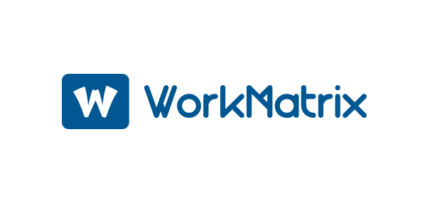

# WorkMatrix

<div align="center">
  
  <h3>Modern Employee Monitoring & Time Tracking Solution</h3>
  <p>Built with Next.js 13, Supabase, and Python</p>
</div>

<div align="center">
  <a href="#features">Features</a> •
  <a href="#architecture">Architecture</a> •
  <a href="#installation">Installation</a> •
  <a href="#documentation">Documentation</a> •
  <a href="#contributing">Contributing</a>
</div>

## Overview

WorkMatrix is a comprehensive employee monitoring and time tracking solution designed for modern workplaces. It combines a powerful Next.js frontend with a Python-based background monitoring service, all backed by Supabase for real-time data synchronization.

## Features

### Employee Features
- 🔐 **Secure Authentication** - Multi-factor authentication with role-based access control
- ⏱️ **Time Tracking** - Automated time tracking with manual adjustments
- 📸 **Screenshot Monitoring** - Configurable screenshot capture with privacy controls
- 📊 **Activity Monitoring** - Application and productivity tracking
- 📈 **Personal Analytics** - Individual performance and time allocation insights
- 🎯 **Task Management** - Personal task tracking and progress monitoring

### Admin Features
- 👥 **Team Management** - Comprehensive employee oversight and team organization
- 📊 **Analytics Dashboard** - Real-time productivity metrics and team performance
- 🔍 **Activity Review** - Detailed employee activity monitoring and analysis
- 📅 **Attendance Management** - Time-off tracking and schedule management
- ⚙️ **Customizable Settings** - Flexible monitoring rules and company policies
- 📱 **Cross-platform Support** - Works on Windows, macOS, and Linux

## Architecture

The project consists of three main components:

### Front-End (Next.js Application)
- **Framework**: Next.js 13 (App Router)
- **Authentication**: Supabase Auth
- **State Management**: React Query & Context API
- **Styling**: Tailwind CSS & shadcn/ui
- **Real-time Updates**: Supabase Realtime

### Background-App (Python Service)
- **Language**: Python 3.9+
- **Monitoring**: System-level activity tracking
- **Storage**: Local SQLite with Supabase sync
- **Deployment**: Windows Service/Systemd
- **Security**: End-to-end encryption
- **Structure**: Modular architecture with separate services

### Dashboard (Admin Panel)
- **Framework**: Next.js 13
- **Data Visualization**: Chart.js
- **Real-time Updates**: Supabase Realtime
- **Role-based Access**: Admin/Manager views

## Installation

### Prerequisites
- Node.js 18.x or higher
- Python 3.9 or higher
- Supabase account
- Git

### Front-End Setup
1. Clone the repository:
```bash
git clone https://github.com/QuantumBreakz/WorkMatrix.git
cd WorkMatrix/Front-End
```

2. Install dependencies:
```bash
npm install
# or
pnpm install
```

3. Configure environment variables:
```bash
cp .env.example .env.local
# Edit .env.local with your Supabase credentials
```

4. Start the development server:
```bash
npm run dev
```

### Background Service Setup
1. Navigate to the Background-App directory:
```bash
cd ../Background-App
```

2. Create a virtual environment:
```bash
python -m venv venv
source venv/bin/activate  # On Windows: venv\Scripts\activate
```

3. Install dependencies:
```bash
pip install -r requirements.txt
```

4. Configure the service:
```bash
cp config/default.toml config/config.toml
# Edit config.toml with your settings
```

5. Run the service:
```bash
python tools/build_background.py  # Build the executable
./scripts/start_workmatrix.ps1   # Start the service
```

## Project Structure

```
WorkMatrix/
├── Front-End/           # Next.js frontend application
├── Background-App/      # Python monitoring service
│   ├── src/            # Source code
│   ├── tools/          # Build and maintenance tools
│   ├── scripts/        # Utility scripts
│   ├── config/         # Configuration files
│   └── docs/           # Service documentation
├── Dashboard/          # Admin dashboard
└── supabase/          # Supabase configuration and migrations
```

## Documentation

Detailed documentation is available in the following sections:

- [Front-End Documentation](Front-End/README.md)
- [Background Service Documentation](Background-App/README.md)
- [Dashboard Documentation](Dashboard/README.md)
- [API Documentation](docs/API.md)
- [Deployment Guide](docs/DEPLOYMENT.md)
- [Security Considerations](SECURITY.md)

## Contributing

We welcome contributions! Please see our [Contributing Guide](CONTRIBUTING.md) for details.

### Development Workflow
1. Fork the repository
2. Create a feature branch
3. Make your changes
4. Submit a pull request

### Code Style
- Front-End: ESLint & Prettier
- Background-App: Black & isort
- Commit messages: Conventional Commits

## Security

For security concerns, please see our [Security Policy](SECURITY.md).

## License

This project is licensed under the MIT License - see the [LICENSE](LICENSE) file for details.

## Support

- 📧 Email: support@workmatrix.com
- 💬 Discord: [Join our community](https://discord.gg/workmatrix)
- 📚 Documentation: [docs.workmatrix.com](https://docs.workmatrix.com)

## Acknowledgments

- [Next.js](https://nextjs.org/)
- [Supabase](https://supabase.io/)
- [shadcn/ui](https://ui.shadcn.com/)
- [Tailwind CSS](https://tailwindcss.com/) 